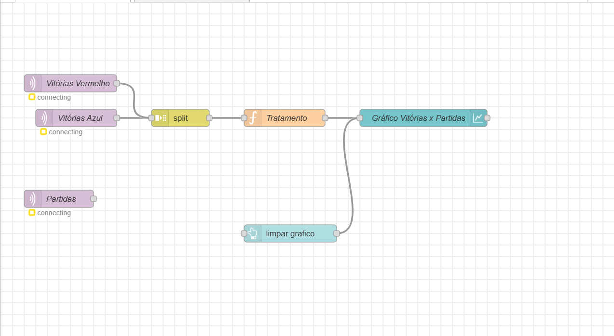

# Sistema de Laser Tag com ESP8266
Projeto de um sistema básico de Laser Tag utilizando ESP32, controle remoto IR, LCD 16x2 (I2C) e LEDs indicadores para simular disparos, vida e munição de um jogador.

## Funcionalidades
Comandos via controle remoto IR (atirar e recarregar)

Sistema de vida com LEDs:

 Verde: vida cheia

 Amarelo: vida média

 Vermelho: vida baixa

Display LCD mostra munição e vida

Cooldown entre disparos e tempo de recarga

Mensagem de "Derrota..." ao zerar a vida

## Componentes
ESP32

Receptor IR (38kHz)

Controle remoto IR

Display LCD 16x2 (com módulo I2C)

LEDs (verde, amarelo, vermelho)

Resistores

## Lógica do Código
setup(): Inicializa o LCD, receptor IR e LEDs, exibindo a mensagem inicial.

loop(): Escuta comandos do controle remoto IR e verifica o estado do jogo.

shoot(): Executa um disparo, reduzindo a munição e a vida do oponente.

reload(): Recarrega a munição após um tempo de espera.

updateLCD() e updateLEDs(): Atualizam o display e os LEDs conforme o estado do jogador.

printOtherPlayerStats(): Exibe no Serial a vida e munição do adversário.

checkGameOver(): Verifica se o jogo acabou e exibe a vitória ou derrota.

resetGame(): Reinicia o jogo após o término de uma rodada.

## Testes
Simulado no Wokwi
https://wokwi.com/projects/426804381928599553

Testes de IR, cooldown, recarga, LEDs e LCD validados

## Melhorias Futuras
Sistema de pontuação com dashboard

Efeitos sonoros com buzzer

Modo multiplayer via Wi-Fi

## Autores
Adrian Modesto Lauzid

Artur Vinícius Lima Ramos da Silva

Gustavo dos Santos Silva

Lucas Pereira de Souza

## Imagem do flow

